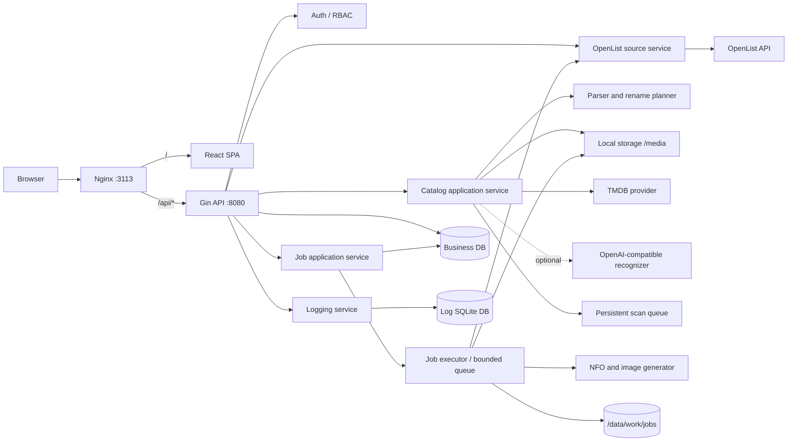
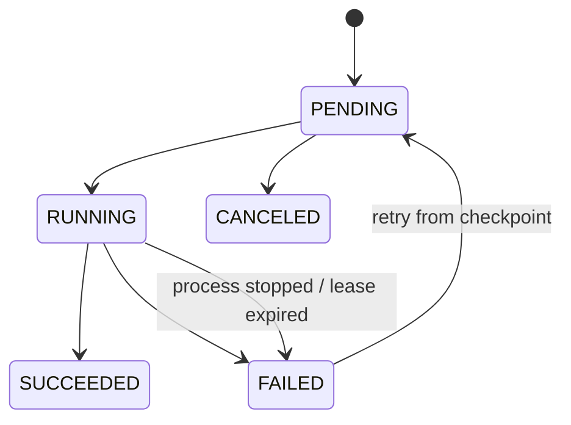
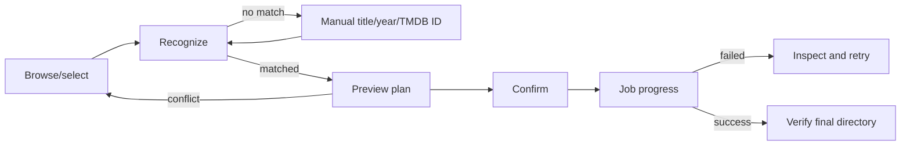

# OScraper 完整设计方案

## 1. 方案结论

OScraper 定位为一个独立的媒体目录刮削工作台：用户可以配置 OpenList 连接，或把本地目录挂载到 `/media`，再创建受控根目录。应用按需浏览或扫描该目录，识别电影、电视剧和动画，预览 TMDB 匹配及文件变更计划，确认后异步完成可选重命名、NFO/图片生成和元数据写入。

应用外壳参考 Seshat：

- 后端：Go + Gin + GORM
- 前端：React + TypeScript + Vite + Appica UI + Tailwind CSS
- 状态：TanStack Query 管理服务端数据，Zustand 管理认证会话
- 数据库：仅支持 SQLite，面向单实例部署
- 鉴权：JWT Bearer Token、`token_version` 主动失效、首次管理员初始化
- 日志：接口日志和结构化业务日志分离，异步写入独立日志数据库
- 部署：前端、Go API 和 Nginx 打包为单一 Docker 镜像
- UI：中英文、深浅色主题、自适应侧边栏、无障碍基础能力

刮削领域行为移植自 ostrm 的手动刮削链路，但用 Go 重新实现并保留原有测试语义，不直接复制 Spring、MyBatis、Quartz 或 Java 服务结构。

## 2. 范围

> 开发状态（2026-08-20）：首版闭环已经实现，包括鉴权与日志、OpenList/本地受控目录、只读扫描、TMDB 匹配、完整电影/剧集预览、分集元数据、存储写入、持久化作业、检查点重试和管理 UI。真实服务灰度属于部署验收，执行步骤见 `docs/operations.md`。

### 2.1 首个可用版本包含

1. 管理 OpenList 连接：地址、Token、账号根路径、QPS/QPM、连接测试。
2. 管理刮削目标：存储来源（OpenList/本地）、受控根目录、媒体类型和重命名权限；本地根目录必须位于 `/media`。
3. 按需加载目录树；大型目录首次只读取当前层。
4. 扫描目标目录并形成媒体候选：
   - 电影：第一层电影目录；根目录平铺视频按单部电影分别处理。
   - 电视剧/动画：第一层剧集根目录；其下递归读取季和媒体文件。
5. 本地正则解析文件名；低置信度时可选调用 OpenAI 兼容接口辅助识别。
6. TMDB 搜索、按年份优选、按 TMDB ID 精确指定，以及电影/剧集详情预览。
7. 只读预览：匹配信息、海报、背景图、目录创建、目录/文件重命名、元数据上传清单、冲突和风险提示。
8. 确认后异步执行：可选整理目录和文件、生成 NFO、下载图片、写入 OpenList 或本地目录。
9. 作业进度、历史、失败原因、操作级检查点和失败续跑。
10. API 日志、业务日志、用户与系统设置管理。

### 2.2 明确不进入首版

- STRM 文件生成及孤立 STRM 清理。
- Emby/Jellyfin 媒体库刷新。
- ostrm 的定时转换任务、Quartz、数据上报和通知系统。
- 自动删除 OpenList 源文件。
- 未经预览确认的批量重命名。
- 剧集逐集 TMDB 元数据和逐集 NFO；首版只生成剧集根级 `tvshow.nfo`、海报和背景图。

### 2.3 后续能力

- 目标目录定时扫描。
- 对已确认规则的候选批量刮削。
- WebSocket/SSE 实时进度；首版扫描使用 1 秒轮询、写作业使用 2 秒轮询。
- 通知渠道和媒体服务器刷新。
- 更多元数据源及刮削 Provider 插件。

## 3. 关键设计原则

### 3.1 预览与执行分离

预览绝不修改 OpenList。执行接口只接受服务端生成的 `preview_id`，不信任客户端回传的重命名计划。预览记录包含目录指纹和过期时间；执行前再次读取目录指纹，内容变化则返回 `409 preview.stale`，要求重新预览。

### 3.2 写操作可恢复，而不是假装具备事务

OpenList 的目录创建、移动、重命名和上传不是一个数据库事务。应用为每一步写操作保存操作记录，并使用幂等检查实现续跑：

- 源不存在、目标已存在：视为该步已成功。
- 源和目标都存在：停止并报告冲突。
- 源和目标都不存在：停止并要求人工检查。
- 仅大小写变化的重命名：先改为确定性的临时名，再改为目标名。
- 重命名和移动永不覆盖；元数据上传只覆盖预览中明确列出的元数据文件。

不自动进行高风险的“回滚重命名”；失败后保留检查点并从安全阶段续跑。

### 3.3 路径是安全边界

所有路径必须经过统一标准化，并满足：

- 绝对路径，以 `/` 开头；清理重复斜杠和尾斜杠。
- 不允许 `.`、`..`、NUL、控制字符或反斜杠逃逸。
- 浏览、预览和执行路径必须是配置的 OpenList `base_path` 与刮削目标 `root_path` 的真实子路径，而不是字符串前缀命中。
- 新名称不能包含 `/`、`\\`、`.`、`..`，并执行长度和控制字符校验。
- OpenList `File-Path` 请求头按 UTF-8 百分号编码，空格编码为 `%20`。

本地路径还必须满足：只允许 `/media` 的真实子路径；逐层使用 `Lstat` 阻止符号链接逃逸；媒体重命名使用不覆盖目标的原子操作；元数据先写同目录临时文件并 `fsync` 后替换。跨文件系统移动不会自动退化为复制后删除。

### 3.4 只迁移领域行为

从 ostrm 迁移以下行为及其测试用例：目录树加载、路径约束、媒体解析、TMDB 匹配、重命名规划、冲突检查、元数据生成、OpenList 写操作、作业检查点和续跑。Java 框架代码不进入新仓库。

## 4. 总体架构



首版为单进程、单副本应用。`internal/app` 是组合根，统一创建 HTTP 路由、扫描运行时、Job 队列和数据清理任务，并按顺序关闭。路由层只负责协议注册，不执行初始化副作用。扫描和写作业使用彼此隔离的持久化有界队列；HTTP 创建扫描后返回 `202`，前端轮询状态。因为业务库、作业工作区和日志库位于本地挂载盘，首版不承诺多副本部署。

## 5. 技术选型

| 层级 | 选型 | 设计理由 |
|---|---|---|
| 前端 | React 19、TypeScript、Vite | 与 Seshat 一致，组件和工程约定可直接参考 |
| UI | Appica UI、Tailwind CSS 4 | 复用 Seshat 的面板、表单、弹窗、Toast、主题和响应式布局 |
| 路由 | React Router | 页面懒加载和认证守卫 |
| 服务端状态 | TanStack Query | 目录、预览、作业和日志查询缓存及轮询 |
| 会话状态 | Zustand | Token 与当前用户，保持职责单一 |
| 后端 | Go、Gin | 与 Seshat 一致，部署产物小，适合 I/O 密集型刮削作业 |
| ORM | GORM | 统一模型、事务和版本化迁移 |
| 数据库 | SQLite | 单机开箱即用，符合应用的单实例定位 |
| API 文档 | Swaggo | 从 Handler 注释生成 OpenAPI |
| 认证 | JWT HS256 + BCrypt | 沿用 Seshat 模型，并用数据库版本使旧 Token 即时失效 |
| 作业 | 数据库作业表 + 有界 Go Worker | 无需引入 Redis，满足单容器恢复和限流需求 |
| 国际化 | i18next/react-i18next | 英文默认，浏览器语言自动选择，手动偏好持久化 |
| 部署 | 多阶段 Docker + Nginx | 单镜像交付，`amd64/arm64` 均可构建 |

Go module 使用 `oscraper`，前端包名使用 `oscraper-web`。

## 6. 后端代码结构

```text
backend/
├── main.go
├── config/
│   └── config.go
├── internal/
│   ├── auth/                 # 密码、JWT、token_version、首次管理员
│   ├── handler/              # HTTP 参数绑定与响应，不放领域逻辑
│   ├── middleware/           # request id、JWT、管理员、访问日志、CORS
│   ├── model/                # GORM 模型
│   ├── repository/           # 数据访问
│   ├── service/
│   │   ├── connection/       # OpenList 连接管理
│   │   ├── target/           # 刮削目标管理
│   │   ├── catalog/          # 目录树和媒体候选
│   │   ├── preview/          # 识别、匹配、预览快照
│   │   ├── scrape/           # 执行编排
│   │   ├── job/              # 作业状态机、恢复、Worker
│   │   └── setting/          # TMDB、AI、日志等设置
│   ├── openlist/
│   │   ├── client.go         # /api/me 与 /api/fs/*
│   │   ├── limiter.go        # 每连接 QPS/QPM 双令牌桶
│   │   └── types.go
│   ├── media/
│   │   ├── parser.go
│   │   ├── season_parser.go
│   │   ├── tmdb_id.go
│   │   ├── planner.go
│   │   └── naming.go
│   ├── provider/
│   │   ├── tmdb/
│   │   └── ai/
│   ├── metadata/
│   │   ├── nfo.go
│   │   └── image.go
│   └── logging/
├── pkg/
│   ├── database/
│   ├── response/
│   └── cryptoutil/
└── docs/                     # 生成的 Swagger
```

领域包不能直接引用 Gin。Handler 中的 HTTP DTO 负责 JSON/校验并转换为不带传输标签的应用命令，Service 负责用例和业务规则，OpenList/TMDB/AI 包仅处理外部协议。Job 的提交/重试/取消由 `JobService` 编排，具体存储变更和产物处理由 `JobExecutor` 执行。

## 7. 核心领域模型

### 7.1 业务数据库

| 表 | 关键字段 | 说明 |
|---|---|---|
| `users` | username、password_hash、is_admin、requires_admin_setup、token_version | 参考 Seshat |
| `openlist_connections` | name、base_url、encrypted_token、username、base_path、qps、qpm、enabled | Token 只加密存储，不通过列表接口返回 |
| `scrape_targets` | source_type、connection_id、name、root_path、library_type、rename_enabled、enabled | 来源为 openlist/local；本地目标不需要 connection_id |
| `scan_runs` | target_id、status、started_at、completed_at、summary | 一次只读目录扫描 |
| `media_candidates` | scan_id、path、kind、fingerprint、parsed_title、year、status | 电影目录、平铺电影或剧集根目录 |
| `scrape_previews` | candidate_id、tmdb_id、media_type、fingerprint、match_json、plan_json、expires_at | 服务端执行凭据 |
| `scrape_jobs` | target_id、preview_id、status、stage、progress、message、error_code、checkpoint、actor_id | 持久化作业状态 |
| `scrape_job_operations` | job_id、sequence、type、source_path、target_path、status、attempts、last_error | 每个 OpenList 写操作的幂等检查点 |
| `system_settings` | key、value、is_secret | TMDB、AI、保留期等全局配置 |
| `admin_audit_logs` | actor_id、action、target、detail、occurred_at | 高风险管理操作，不能由日志清理功能删除 |

首个开发版本可用 GORM `AutoMigrate` 起步；首个公开版本前固定 schema，并改为嵌入式、带版本号的 SQL migration，防止后续自动迁移产生不可控变更。

### 7.2 作业状态机



执行阶段：

```text
PREPARING -> RENAMING -> GENERATING -> UPLOADING -> VERIFYING -> COMPLETED
```

- `PREPARING`：校验预览、目录指纹、目标范围和 TMDB 快照。
- `RENAMING`：按操作表顺序执行目录创建、目录重命名、文件移动和文件重命名。
- `GENERATING`：在持久化工作区生成 NFO 并下载图片。
- `UPLOADING`：将预览列出的元数据文件上传到最终目录。
- `VERIFYING`：重新读取最终目录，确认名称和上传文件存在。
- `COMPLETED`：记录结果并清理工作区。

应用启动时把遗留的 `RUNNING` 作业标记为可重试 `FAILED`；用户可从检查点续跑。后续可升级为带租约的自动恢复。

## 8. OpenList 协议适配

| 用途 | 方法 | OpenList 接口 | 关键行为 |
|---|---|---|---|
| 测试连接 | GET | `/api/me` | 校验 Token、账号状态，读取 username/base_path |
| 列目录 | POST | `/api/fs/list` | `page=1`、`per_page=0`、按需 `refresh` |
| 校验路径 | POST | `/api/fs/get` | 确认目标存在且为目录 |
| 重命名 | POST | `/api/fs/rename` | `overwrite=false` |
| 建目录 | POST | `/api/fs/mkdir` | 先检查是否已存在 |
| 移动 | POST | `/api/fs/move` | 同源目录批量 names，不覆盖目标 |
| 上传 | PUT | `/api/fs/put` | `File-Path` 编码、`As-Task=false`、仅元数据允许覆盖 |

所有文件系统接口共享该 OpenList 连接的双层令牌桶。QPS 控制突发，QPM 控制持续总量；任一值为 `0` 表示对应维度不限流。不同连接的额度相互隔离。

HTTP 客户端统一配置连接、响应头和总超时，限制错误响应体大小；只接受 HTTP/HTTPS。因为 OpenList 常部署在内网，允许 RFC1918 和 loopback 目标，但阻止链路本地、组播、未指定地址及云元数据地址，并对跳转后的地址再次校验。

## 9. 媒体识别与命名

### 9.1 识别顺序

1. 从目录路径中提取 `{tmdbid-N}`；存在时直接加载 TMDB 详情。
2. 按目标媒体类型运行本地解析器，提取标题、年份、季、集和置信度。
3. 本地置信度低于 70 且启用 AI 时，调用 OpenAI 兼容接口；要求 JSON Schema 结构化结果，并再次本地校验。
4. 用户可在预览页修改标题、年份，或直接输入 TMDB ID。
5. 搜索结果优先精确年份，否则选评分最高的有效结果；必须展示给用户确认。

AI 不能猜测输入中不存在的年份或季集；失败、超时、结构不合法时回退到本地解析，不阻断手动修正。

### 9.2 电影规则

标准目录和媒体基础名：

```text
标题 (年份) {tmdbid-ID}
```

示例：

```text
后室 (2026) {tmdbid-1083381}/
├── 后室 (2026) {tmdbid-1083381}.mkv
├── 后室 (2026) {tmdbid-1083381}.nfo
├── 后室 (2026) {tmdbid-1083381}-poster.jpg
└── 后室 (2026) {tmdbid-1083381}-backdrop.jpg
```

根目录平铺电影按单个视频形成候选。开启整理后创建标准电影目录，并把与该视频唯一关联的字幕、图片和 NFO 一起移动；其他电影和已有子目录不参与。

### 9.3 电视剧和动画规则

```text
剧名 (年份) {tmdbid-ID}/
├── tvshow.nfo
├── poster.jpg
├── fanart.jpg
└── Season 01/
    ├── 剧名 - S01E01.mkv
    └── 剧名 - S01E01.zh-CN.ass
```

- 季目录识别支持 `第4季`、`第四季`、`Season 4`、独立 `S04`、`Specials` 和 `特别篇`。
- 一个目录出现不同季号时视为歧义，不自动改名。
- 根目录平铺剧集只有在文件名包含明确季集标记时才创建季目录并成组移动伴随文件。
- `tvshow.nfo`、`poster.jpg`、`fanart.jpg` 等剧集共享文件保留在剧集根目录。
- 动画复用 TV 的 TMDB 类型，并额外支持绝对集数；没有季目录时默认 Season 01，但必须在预览中显式提示。

### 9.4 冲突保护

以下情况预览标红且禁止执行：

- 多个源目录或文件映射到同一目标。
- 目标目录或目标媒体文件已经存在。
- 源路径已离开目标根目录。
- 所选路径是 TV/Anime 目标根目录而不是剧集根目录。
- 电影目标根目录同时包含多部电影却试图作为一个候选执行。
- 季目录或季集解析存在歧义。

## 10. 作业并发与一致性

- 全局 Worker 默认 2 个，可通过环境变量调整为 1–4。
- 同一刮削目标最多一个执行作业；同一候选最多一个活动作业。
- 同一 OpenList 连接的写阶段串行化，读和 TMDB 请求可以并行。
- 作业队列有固定容量，满时返回 `429 job.queue_full`，不无限堆积内存。
- `POST execute` 支持 `Idempotency-Key`；同一用户、预览和 Key 返回同一个作业。
- 每完成一个写操作立即提交数据库检查点。
- 工作区位于 `/data/work/jobs/<job_id>`，以便容器重启后保留生成文件；成功后删除，失败作业按保留期清理。
- 执行期间编辑或删除连接/目标被禁止；只能先禁用新作业，待活动作业结束。

## 11. REST API 设计

统一响应：

```json
{
  "code": 0,
  "message": "success",
  "data": {}
}
```

错误同时返回稳定的 `error_code`，前端按当前语言翻译；服务端原始消息只作为诊断回退。

### 11.1 认证与用户

| 方法 | 路径 | 权限 | 用途 |
|---|---|---|---|
| POST | `/api/auth/login` | 公开 | 登录 |
| POST | `/api/auth/logout` | 登录 | 使同版本 Token 失效 |
| POST | `/api/auth/setup-admin` | 引导管理员 | 首次设置正式凭据 |
| GET | `/api/user/profile` | 登录 | 当前用户 |
| PUT | `/api/user/password` | 登录 | 改密并递增 token_version |
| GET/PUT | `/api/admin/users/*` | 管理员 | 用户和角色管理，后续启用注册时使用 |

空数据库创建受限的 `admin/admin` 引导账户；引导账户只能完成管理员初始化、查看个人信息和退出。生产模式要求 `JWT_SECRET` 至少 32 位且不能使用默认值。公开注册默认关闭。

### 11.2 OpenList 连接

| 方法 | 路径 | 用途 |
|---|---|---|
| GET/POST | `/api/openlist-connections` | 列表/创建 |
| GET/PUT/DELETE | `/api/openlist-connections/:id` | 详情/编辑/删除 |
| POST | `/api/openlist-connections/test` | 保存前测试 |
| POST | `/api/openlist-connections/:id/test` | 测试已保存配置 |
| POST | `/api/openlist-connections/:id/rotate-token` | 更新 Token |

列表和详情只返回 `has_token` 与掩码，不返回明文 Token。

### 11.3 刮削目标、目录和扫描

| 方法 | 路径 | 用途 |
|---|---|---|
| GET/POST | `/api/scrape-targets` | 列表/创建目标 |
| GET/PUT/DELETE | `/api/scrape-targets/:id` | 详情/编辑/删除 |
| GET | `/api/scrape-targets/:id/tree` | 读取根层目录 |
| GET | `/api/scrape-targets/:id/tree/children?path=` | 按需读取下一层 |
| POST | `/api/scrape-targets/:id/scans` | 创建只读扫描 |
| GET | `/api/scrape-targets/:id/scans/:scanId` | 扫描状态与摘要 |
| GET | `/api/scrape-targets/:id/candidates` | 候选列表、筛选和分页 |

### 11.4 预览与执行

| 方法 | 路径 | 用途 |
|---|---|---|
| POST | `/api/scrape-targets/:id/previews` | 自动识别并预览 |
| POST | `/api/scrape-targets/:id/previews/search` | 用标题/年份重新匹配 |
| POST | `/api/scrape-targets/:id/previews/tmdb` | 用 TMDB ID 精确匹配 |
| POST | `/api/scrape-targets/:id/jobs` | 使用 preview_id 提交作业 |
| GET | `/api/scrape-jobs` | 作业历史 |
| GET | `/api/scrape-jobs/:id` | 状态、阶段、进度和结果 |
| GET | `/api/scrape-jobs/:id/operations` | 操作级明细 |
| POST | `/api/scrape-jobs/:id/retry` | 从检查点续跑 |
| POST | `/api/scrape-jobs/:id/cancel` | 仅取消尚未执行的作业 |

执行请求示例：

```json
{
  "preview_id": 123,
  "rename_media": true,
  "confirm_directory_fingerprint": "sha256:..."
}
```

### 11.5 设置与日志

| 方法 | 路径 | 用途 |
|---|---|---|
| GET/PUT | `/api/settings/scraping` | TMDB、语言、图片尺寸、超时和代理 |
| POST | `/api/settings/scraping/test-tmdb` | 测试 TMDB |
| GET/PUT | `/api/settings/ai` | 可选 AI 配置 |
| POST | `/api/settings/ai/test` | 测试 AI |
| GET | `/api/admin/logs` | API 请求日志 |
| GET | `/api/admin/application-logs` | 业务日志 |
| GET | `/api/admin/audit-logs` | 高风险操作审计 |

## 12. 鉴权与凭据安全

### 12.1 角色

- 管理员：连接、目标、系统凭据、用户、日志和所有刮削操作。
- 普通用户：只读浏览、预览和查看作业；是否允许提交不带重命名的刮削由系统开关控制。
- 重命名、Token 轮换、目标删除、日志清理始终要求管理员。

### 12.2 JWT

- 只接受 `Authorization: Bearer <token>`，不使用 Cookie。
- Token 存在 LocalStorage，前端请求设置 `credentials: omit`。
- Token 有效期 24 小时，包含 user_id、username、is_admin、token_version 和 exp。
- 每次认证从数据库读取 token_version 和最新角色；退出、改密、角色变化时递增版本。
- 使用严格 CSP、禁止内联脚本、构建产物不注入运行时 Secret，降低 LocalStorage Token 的 XSS 风险。

### 12.3 外部凭据

- OpenList Token、TMDB API Key、AI API Key 使用 AES-256-GCM 加密后保存。
- `CREDENTIAL_ENCRYPTION_KEY` 由部署环境提供，和 `JWT_SECRET` 分开；生产模式缺失或长度不合格时拒绝启动。
- API 只允许覆盖或轮换 Secret，不提供读取明文接口。
- 日志对 authorization、cookie、token、secret、password、signature、api-key 等字段递归脱敏。

## 13. 日志与审计

沿用 Seshat 的双日志设计：

### 13.1 API 请求日志

记录 request_id、时间、方法、路由模板、状态码、耗时、请求/响应字节、客户端、用户、connection_id、target_id、job_id 和稳定错误码。默认不保存普通请求体；仅在明确的调试场景保存大小受限且已脱敏的摘要。

### 13.2 业务日志

统一方法：

```go
logging.Info("scrape", "job stage completed", logging.Fields{
    "request_id": requestID,
    "job_id": jobID,
    "target_id": targetID,
    "stage": "UPLOADING",
})
```

稳定 source 使用 `server`、`auth`、`openlist`、`catalog`、`preview`、`scrape`、`job`、`tmdb`、`ai`。绝不记录 Token、API Key、完整 Authorization 或带签名的下载 URL。

### 13.3 审计日志

以下操作写入不可从日志页面清除的审计表：连接创建/编辑/删除、Token 轮换、开启重命名、作业提交/重试、系统凭据更新、用户角色变化、日志清理。

接口日志和业务日志固定写入 `/cache/logs/app/api-logs.db`，使用 WAL、异步有界队列和批量写入；队列满时增加 dropped 计数，不阻塞刮削主流程。默认保留 7 天，可配置 1–30 天。

## 14. 前端信息架构

```text
概览
刮削
  ├── OpenList 连接
  ├── 刮削目标
  ├── 媒体工作台
  └── 作业记录
管理
  ├── 系统设置
  ├── API 日志
  ├── 业务日志
  └── 审计日志
个人资料
```

### 14.1 页面

1. **登录/管理员初始化**：复用 Seshat 流程。
2. **概览**：连接健康度、目标数、待复核候选、运行中/失败作业、最近活动。
3. **OpenList 连接**：卡片或表格、测试连接、Token 轮换、QPS/QPM。
4. **刮削目标**：根目录、媒体类型、重命名权限、最近扫描和快捷操作。
5. **媒体工作台**：
   - 左栏：懒加载目录树/候选列表。
   - 中栏：本地识别与 TMDB 搜索结果。
   - 右栏：海报、背景、媒体详情、变更计划和风险。
   - 底部固定操作区：重新匹配、仅写元数据、整理并写元数据。
6. **作业记录**：状态筛选、阶段进度、操作明细、失败续跑。
7. **系统设置**：TMDB、AI、代理、日志保留期、普通用户权限。
8. **日志页**：沿用 Seshat 的数据表、筛选、详情和导出交互。

### 14.2 视觉和交互

- 沿用 Seshat 的 240px 桌面侧边栏、移动端抽屉、顶部栏和用户区。
- 品牌主色使用 emerald，风险写操作使用 amber/red，不用颜色作为唯一状态信息。
- 沿用半透明面板、1.25rem 圆角、轻阴影和背景网格，但工作台主体减少装饰，优先信息密度。
- 支持系统/亮色/暗色主题。
- 所有用户可见文本、aria-label、title、空状态和错误提示均从中英文 i18n 资源读取。
- 日期、数字和持续时间按当前 locale 格式化；英文为默认语言，手动选择优先于浏览器语言并持久化。
- 破坏性确认弹窗必须展示 OpenList 连接、目标目录、重命名数量和将覆盖的元数据文件数量。

### 14.3 预览页面状态



## 15. 配置与部署

### 15.1 目录

| 容器目录 | 用途 |
|---|---|
| `/data/db/openlist-scraper.db` | SQLite 业务库 |
| `/data/work/jobs` | 可恢复作业工作区 |
| `/media` | 宿主机本地媒体目录，只允许本地目标访问 |
| `/cache/logs/app/api-logs.db` | API/业务日志库 |
| `/cache/logs/nginx` | Nginx 日志 |
| `/cache/tmp` | 可丢弃临时缓存 |

### 15.2 主要环境变量

| 变量 | 默认值 | 说明 |
|---|---|---|
| `SQLITE_PATH` | `/data/db/openlist-scraper.db` | SQLite 文件 |
| `LOCAL_MEDIA_ROOT` | `/media` | 本地媒体安全根目录，容器部署不建议修改 |
| `JWT_SECRET` | 无生产默认值 | 至少 32 位 |
| `CREDENTIAL_ENCRYPTION_KEY` | 无 | 32-byte key 的 base64 表示 |
| `TZ` | `UTC` | 应用时区 |
| `PUID` | `1000` | 容器内应用运行用户 ID，必须大于 0 |
| `PGID` | `1000` | 容器内应用运行组 ID，必须大于 0 |
| `UMASK` | `002` | 应用新建文件和目录的权限掩码 |
| `SCRAPE_WORKERS` | `2` | 1–4 |
| `SCRAPE_QUEUE_SIZE` | `100` | 有界作业队列 |
| `API_LOG_QUEUE_SIZE` | `5000` | 日志队列 |
| `API_LOG_BATCH_SIZE` | `100` | 日志批次 |

外部 Web 端口建议使用 `3113`，避免与 Seshat 默认的 `3112` 冲突；Go API 固定监听容器内 `8080`。入口进程以 root 完成用户映射及 `/data`、`/cache` 初始化后，Nginx 和 Go 服务均以 `PUID:PGID` 运行；入口进程不修改 `/media` 的所有权。

### 15.3 容器退出

收到 SIGTERM 后：停止接收新作业，HTTP 最多等待 10 秒，Worker 保存当前操作检查点，日志队列刷新，最后退出。OpenList 的单个进行中请求允许完成，但不启动下一写操作。

## 16. 从 ostrm 的迁移映射

| ostrm 源 | OScraper 目标 | 策略 |
|---|---|---|
| `OpenlistApiService` | `internal/openlist/client.go` | 重写协议层，保留官方端点、编码、错误和限流测试 |
| `OpenlistApiRateLimiter` | `internal/openlist/limiter.go` | 迁移双令牌桶行为 |
| `ManualScrapingService` | `service/preview` + `service/scrape` + `media/planner` | 拆分 1900+ 行巨型服务 |
| `ManualScrapingJobService` | `service/job` | 迁移持久化状态、单目标互斥和失败续跑 |
| `TaskMediaParser` | `internal/media/parser.go` | 先移植测试向量，再实现 |
| `SeasonDirectoryNameParser` | `internal/media/season_parser.go` | 保留中文数字、Specials、歧义规则 |
| `TmdbIdExtractor` | `internal/media/tmdb_id.go` | 原样迁移语义 |
| `TmdbApiService` | `internal/provider/tmdb` | 重写 HTTP、超时、代理、重试和响应模型 |
| `AiFileNameRecognitionService` | `internal/provider/ai` | 可选能力，严格结构化输出 |
| `NfoGeneratorService` | `internal/metadata/nfo.go` | 保留 XML 转义和 Kodi 兼容字段 |
| `CoverImageService` | `internal/metadata/image.go` | 流式下载、大小和内容类型限制 |
| `ManualScrapingServiceTest` | Go 表驱动测试 | 端口行为测试，不逐行翻译实现 |

不迁移 `TaskExecutionService` 的 STRM 流程、Handler Chain、Quartz、媒体服务器、通知和 Java/Spring 基础设施。

## 17. 测试方案

### 17.1 后端单元测试

- 路径标准化和真实子路径判断。
- 电影/TV/动画解析、中文季数、Specials、绝对集数。
- 平铺电影和伴随文件归组。
- 平铺剧集创建季目录和伴随文件迁移。
- 目标冲突、大小写重命名、歧义季目录。
- TMDB 按年份和评分选择、TMDB ID 直查。
- NFO XML 转义和文件命名。
- JWT、token_version、引导管理员和权限。
- Secret 加密、错误字段和日志递归脱敏。
- 双层令牌桶及不同连接隔离。

### 17.2 协议和集成测试

- 使用 `httptest.Server` 模拟 OpenList 和 TMDB。
- 校验 `/api/fs/list|rename|mkdir|move|put` 的方法、请求头、请求体和错误映射。
- 预览后目录变化必须返回 409。
- 作业在每个操作点中断后都能幂等续跑。
- 同一目标第二个作业被拒绝，不同目标可并发。
- 连接和目标删除受活动作业保护。
- 使用临时 SQLite 数据库运行核心 repository 测试。

### 17.3 前端测试

- i18n 中英文 key、插值变量和语言优先级一致。
- JWT 启动恢复、401 清会话、管理员守卫。
- 目录树按需加载，不误选前缀相似路径。
- 无匹配、手动 TMDB ID、预览过期、冲突和失败续跑交互。
- 破坏性确认弹窗完整展示影响范围。
- 作业轮询在完成/失败后停止。

### 17.4 验收场景

1. 添加局域网 OpenList，测试成功后 Token 不在任何列表或日志中出现。
2. 电影根目录包含多个平铺视频时，每个视频独立匹配且不会合并。
3. 电视剧从 `Show/S1/raw.S01E01.mkv` 预览为标准根目录、Season 01 和标准文件名。
4. 执行前外部新增同名目标，作业停止且不覆盖。
5. 上传两张图片后进程重启，重试只继续剩余步骤。
6. TMDB/AI 不可用时仍可用 TMDB ID 完成预览；AI 失败不会阻断本地解析。
7. 英文、中文、亮色、暗色和移动端布局均可完成主流程。

## 18. 分阶段实施计划

### Phase 0：骨架与规范

- 初始化 Go/React 工程、Docker、Compose、Nginx、CI。
- 建立统一响应、配置、数据库、i18n、主题和测试基座。
- 把 Seshat 可复用的通用实现迁入并改名，不复制 Webhook/通知业务。

完成标准：前后端可启动，健康检查、Swagger、双语登录页和容器构建通过。

### Phase 1：认证、日志和设置

- 引导管理员、JWT、token_version、角色守卫。
- API/业务/审计日志与后台查询。
- Secret 加密和 TMDB/AI 基础设置。

完成标准：安全基线和日志脱敏测试通过。

### Phase 2：OpenList 连接与目录浏览

- 连接 CRUD、测试、Token 轮换、限流。
- 目标 CRUD、路径校验、懒加载目录树。
- 移植 OpenList client/rate limiter 测试。

完成标准：可安全浏览指定根目录，不能越界。

### Phase 3：识别与预览

- 移植解析器、季目录、TMDB ID 和重命名规划测试。
- TMDB Provider、可选 AI Provider。
- 候选扫描、预览快照、目录指纹和 UI 工作台。

完成标准：电影、TV、动画和平铺电影都能形成准确、只读的变更预览。

实施状态：已完成。预览会强制刷新 OpenList 清单并校验扫描指纹，展开电影、季目录、剧集与伴随文件重命名，检查目标占用和重复映射，并把 NFO XML 与可用图片源固化到 24 小时预览快照。

### Phase 4：异步执行与恢复

- 作业状态机、Worker、操作表、工作区。
- OpenList mkdir/move/rename/put。
- NFO/图片生成、上传、验证、失败续跑。

完成标准：故障注入覆盖每个阶段，重试不重复或覆盖媒体文件。

实施状态：已完成。作业与操作检查点持久化保存；提交支持幂等键和有界队列；同一连接写入串行化并复用 QPS/QPM 限流；执行前复核指纹，逐步检查源/目标状态，生成并流式下载受限图片，上传后验证最终路径。进程中断的作业启动时转为可重试失败状态，已成功操作不会重复执行。

### Phase 5：产品化

- 概览、作业历史、筛选、日志导出、完整中英文。
- ARM64/AMD64 镜像、升级迁移、备份恢复文档。
- 性能和安全测试、真实 OpenList 小规模灰度。

完成标准：全部验收场景通过，再考虑批量和定时能力。

实施状态：代码和自动化交付项已完成。概览、作业筛选/进度/明细、失败重试、待执行取消、三类日志搜索与 CSV 导出、中英文界面、版本化迁移、保留期清理、备份恢复文档和多架构镜像工作流均已提供。真实 OpenList 灰度必须由部署者在具备实际连接和 TMDB 凭据的环境按运维清单执行，不在单元测试中模拟为“已通过”。

## 19. 首版完成定义

- 用户能在浏览器中完成“连接 OpenList → 选择受控根目录 → 选中媒体 → 校正 TMDB → 查看完整预览 → 确认执行 → 查看进度/结果”的闭环。
- 所有源媒体改名/移动均经过明确预览，冲突时不覆盖。
- 应用重启后失败作业能从持久化检查点安全续跑。
- OpenList Token、TMDB Key、AI Key 不通过 API 或日志泄露。
- 中英文、深浅色和桌面/移动端均可用。
- 核心 ostrm 手动刮削行为由 Go 测试覆盖，且不引入 STRM/Quartz/Spring 依赖。
